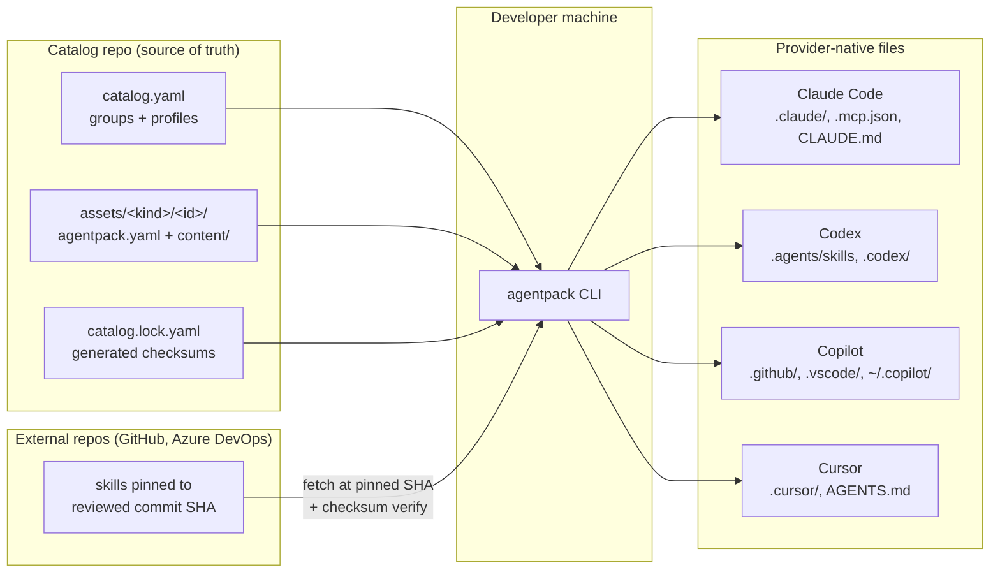
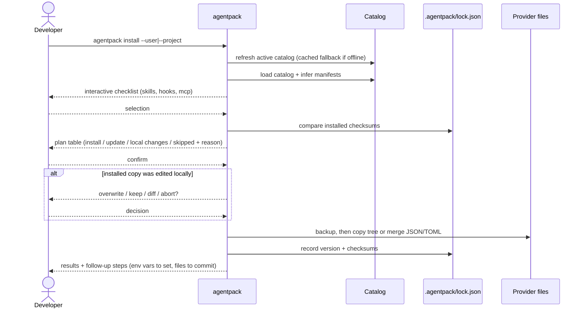
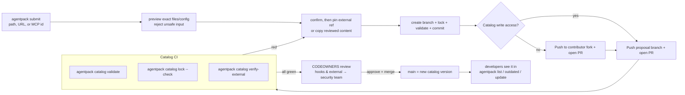
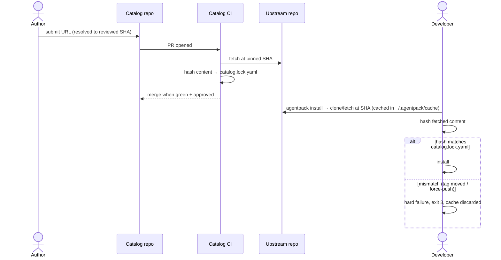
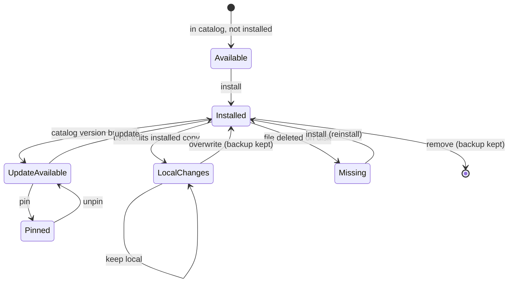
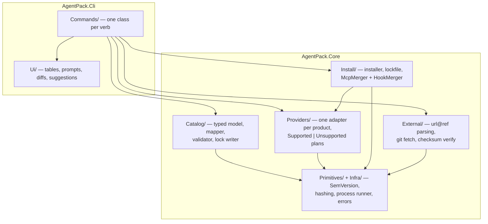

# How AgentPack Works

Visual guide to the architecture and the main flows. All diagrams render natively on GitHub.

## Big picture

One catalog repo feeds every developer machine and every AI tool. The CLI translates catalog assets into each provider's native format — nothing is invented, every path is the one the product documents.

## Installing: `agentpack install`

Planning is read-only for installed files. Install and update refresh the catalog first (with an offline cache fallback), then applying merges into shared config files, records everything in a lockfile, and never overwrites local edits silently.

## Contributing: `submit` always creates a PR

The CLI scaffolds, humans review, CI validates. Nothing reaches developer machines without passing this gate.

## External assets: pinned, hashed, re-reviewed

AgentPack follows an upstream branch only once during `submit`, immediately resolves it to a commit SHA, and stores that immutable pin. Installs never follow the branch. A ref bump is a new PR, so third-party changes always get human eyes.

## Install states and drift

The lockfile stores a checksum of what was installed. Every plan compares disk against it, so local edits are always detected before anything is overwritten.

## What lands where

One asset, four native formats. Merges add entries; they never rewrite or delete what the user already has (conflict = error, not overwrite).

```mermaid
flowchart TD
    HOOK["hook asset<br/>assets/hooks/secret-scan/"]
    MCP["mcp asset<br/>assets/mcp/github/"]
    SKILL["skill asset<br/>assets/skills/grill-me/"]

    HOOK --> H1["Claude: .claude/settings.json<br/>hooks.PreToolUse + matcher"]
    HOOK --> H2["Codex: .codex/hooks.json<br/>same structure as Claude"]
    HOOK --> H3["Copilot: .github/hooks/secret-scan.json<br/>version 1, bash/powershell"]
    HOOK --> H4["Cursor: .cursor/hooks.json<br/>version 1, camelCase events"]

    MCP --> M1["Claude: .mcp.json<br/>env: dollar-brace VAR"]
    MCP --> M2["Codex: .codex/config.toml<br/>env_vars = [names]"]
    MCP --> M3["Copilot: .vscode/mcp.json servers key<br/>env: dollar-brace env:VAR"]
    MCP --> M4["Cursor: .cursor/mcp.json<br/>env: dollar-brace env:VAR"]

    SKILL --> S1["Claude: .claude/skills/grill-me/"]
    SKILL --> S2["Codex: .agents/skills/grill-me/"]
    SKILL --> S3["Copilot: .github/skills/grill-me/"]
    SKILL --> S4["Cursor: .cursor/skills/grill-me/"]
```

Full path matrix with doc links: [provider-mapping.md](provider-mapping.md).

## Codebase layout

Typed core, thin CLI. All string parsing happens once at the YAML boundary; everything behind it is enums, records, and exhaustive switches.

Every cell of the provider matrix and every merge format is pinned by golden tests (`tests/AgentPack.Tests`) — changing what lands on disk is always a deliberate, reviewed decision.
