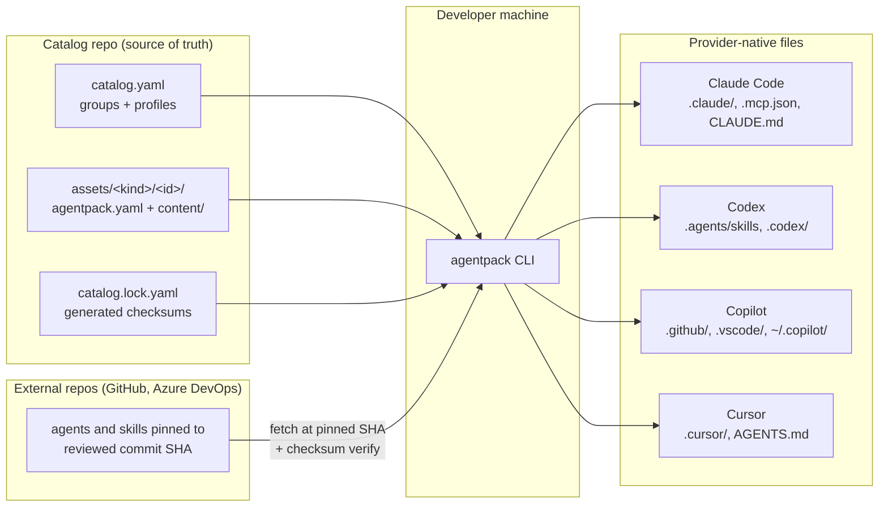
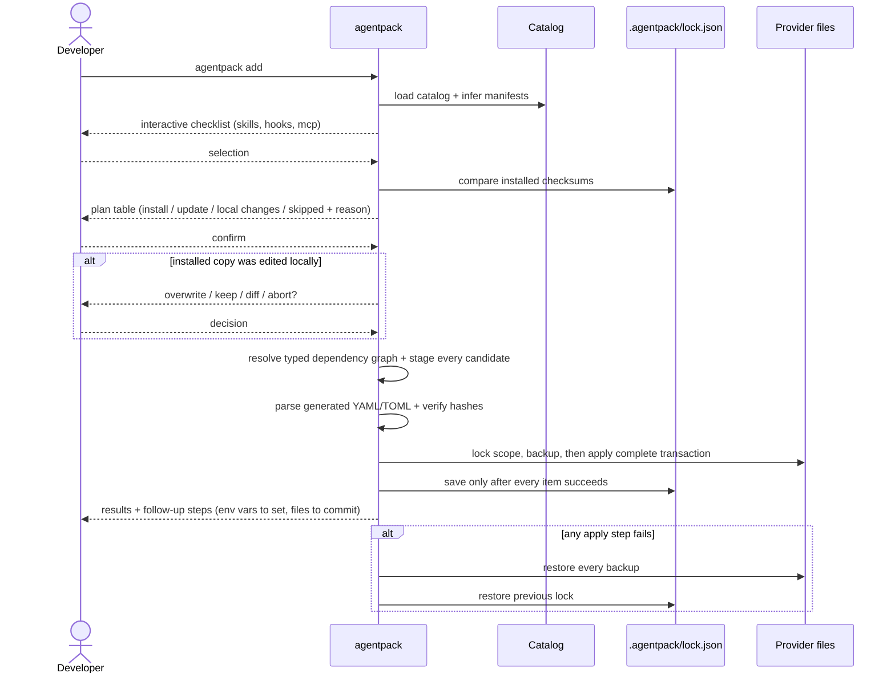
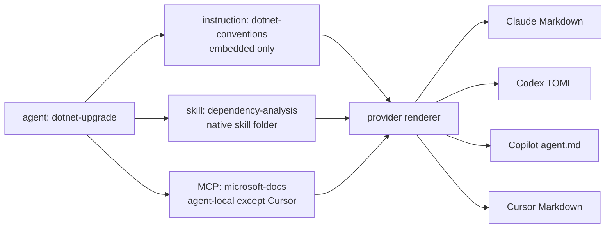
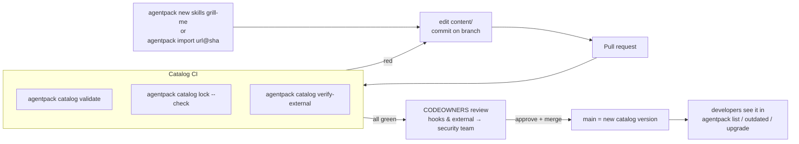
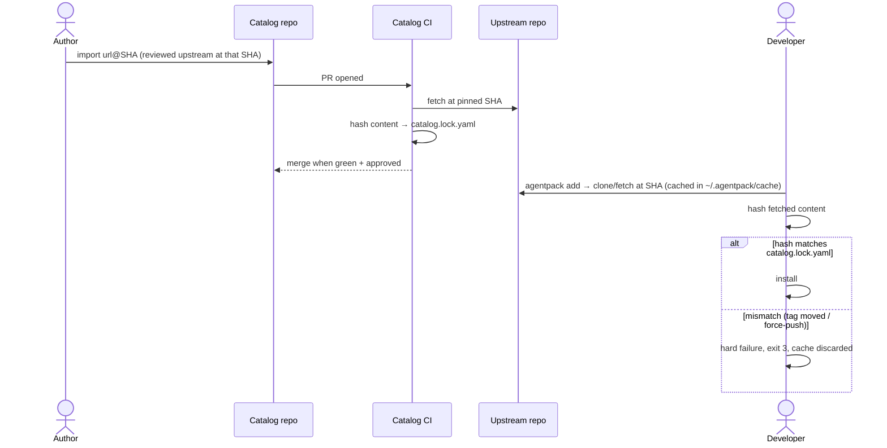
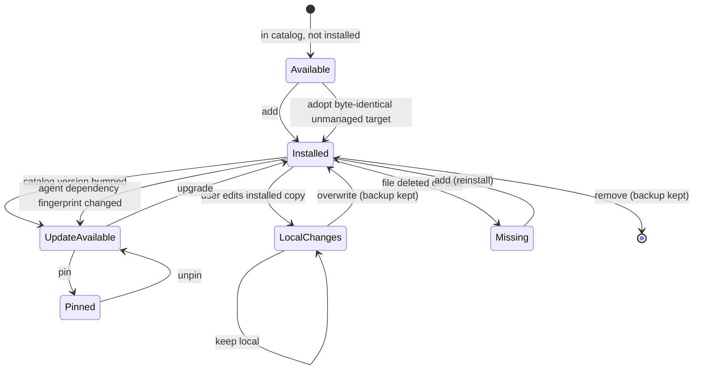
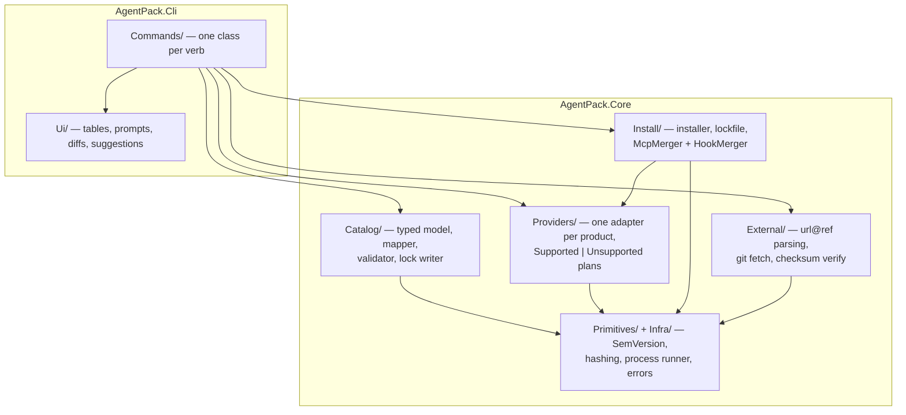

# How AgentPack Works

Visual guide to the architecture and the main flows. All diagrams render natively on GitHub.

## Big picture

One catalog repo feeds every developer machine and every AI tool. The CLI translates catalog assets into each provider's native format — nothing is invented, every path is the one the product documents.

## Installing: `agentpack add`

Planning is read-only and network-free. Applying merges into shared config files without touching what the user already has, records everything in a lockfile, and never overwrites local edits silently.

For an agent, resolution produces a provider-specific closure: private instruction inputs, native skill installs, agent-local MCP (or Cursor's inherited shared MCP), then the generated native agent. Shared dependencies are planned once. All drift, pins, unmanaged targets, environment requirements, and merge conflicts are discovered before writing.

## Agent dependency graph

The graph is typed before planning. Version ranges check the catalog's one effective version. Wrong kinds, incompatible versions/providers, blocked dependencies, missing MCP tool inventories, and unpinned or unchecked external sources stop compilation with a stable error and corrective action.

## Contributing: everything is a PR

The CLI scaffolds, humans review, CI validates. Nothing reaches developer machines without passing this gate.

## External assets: pinned, hashed, re-reviewed

AgentPack never follows upstream branches. A ref bump is a PR, so third-party changes always get human eyes.

## Install states and drift

The lockfile stores a checksum of what was installed. Every plan compares disk against it, so local edits are always detected before anything is overwritten.

`--yes` confirms a non-interactive plan but never decides drift. A conflict exits `3` until the caller passes `--force` (backup and overwrite) or `--keep-local` (skip the complete affected agent closure). Managed snapshots let the interactive diff compare the last generated version, current local version, and staged candidate. AgentPack does not three-way merge prompts, skill content, or frontmatter. A deliberate customization belongs in `.agentpack/catalog.yaml` plus `.agentpack/assets/...`, where it remains typed and reviewable.

## Ownership, removal, and pruning

Every lock entry records whether it was directly requested and why an automatic install exists, for example `agent:dotnet-upgrade`, `agent:api-builder`, or `profile:backend`. Removing one agent drops only its ownership edge. Shared dependencies remain; newly unreferenced automatic installs become orphans. `agentpack prune` previews them and removes only clean orphans. Locally modified orphans are never automatically deleted, and `remove --keep-local` unregisters a generated agent while leaving its file unmanaged.

Agent-local MCP and embedded instructions disappear with the generated agent because they have no separate installed target. Cursor-global MCP dependencies retain ownership edges and are pruned only when no agent or direct request needs them.

## Render fingerprints and updates

An agent lock entry fingerprints the canonical agent source, normalized manifest and portable tools, every imported id/version/checksum, MCP configuration/tool inventory, provider, and scope. Model metadata is excluded because compilation always strips it and inherits the current/default model. A dependency content change therefore makes the agent outdated without an agent version bump. A plan reports local edits before rebuilding; if both local changes and a dependency-driven rebuild exist, the user must keep or overwrite the generated agent first.

## Guarantee boundary

AgentPack guarantees typed dependency resolution, source integrity, provider compatibility checks, deterministic generated syntax, transactional application, backups, rollback, ownership tracking, and local-change detection. `doctor`, compile, and post-install diagnostics make the remaining runtime requirements explicit. AgentPack cannot guarantee that an external MCP endpoint is online, environment values are actually set, a future provider release retains today's format, or a model chooses to invoke a skill.

## What lands where

One asset, four native formats. Merges add entries; they never rewrite or delete what the user already has (conflict = error, not overwrite).

```mermaid
flowchart TD
    HOOK["hook asset<br/>assets/hooks/secret-scan/"]
    MCP["mcp asset<br/>assets/mcp/github/"]
    SKILL["skill asset<br/>assets/skills/grill-me/"]

    HOOK --> H1["Claude: .claude/settings.json<br/>hooks.PreToolUse + matcher"]
    HOOK --> H2["Codex: .codex/hooks.json<br/>same structure as Claude"]
    HOOK --> H3["Copilot: .github/hooks/secret-scan.json<br/>version 1, bash/powershell"]
    HOOK --> H4["Cursor: .cursor/hooks.json<br/>version 1, camelCase events"]

    MCP --> M1["Claude: .mcp.json<br/>env: dollar-brace VAR"]
    MCP --> M2["Codex: .codex/config.toml<br/>env_vars = [names]"]
    MCP --> M3["Copilot CLI: .github/mcp.json<br/>mcpServers; env: dollar-brace VAR"]
    MCP --> M4["Cursor: .cursor/mcp.json<br/>env: dollar-brace env:VAR"]

    SKILL --> S1["Claude: .claude/skills/grill-me/"]
    SKILL --> S2["Codex: .agents/skills/grill-me/"]
    SKILL --> S3["Copilot: .github/skills/grill-me/"]
    SKILL --> S4["Cursor: .cursor/skills/grill-me/"]
```

Full path matrix with doc links: [provider-mapping.md](provider-mapping.md).

## Codebase layout

Typed core, thin CLI. All string parsing happens once at the YAML boundary; everything behind it is enums, records, and exhaustive switches.

Every cell of the provider matrix and every merge format is pinned by golden tests (`tests/AgentPack.Tests`) — changing what lands on disk is always a deliberate, reviewed decision.
